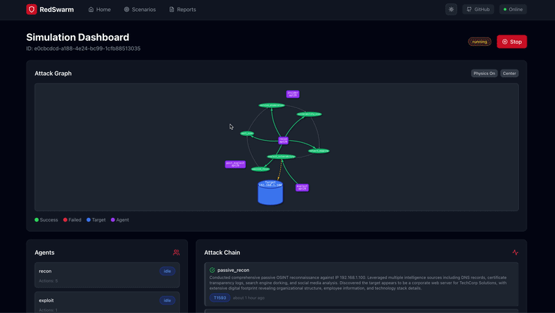

# 🔴 RedSwarm: AI-Powered Red Team Simulation Engine

> *"A Simple and Universal Swarm Intelligence Engine for Red Teaming — Simulate Real Attackers, Not Just Tools."*

[](https://github.com/tal7aouy/RedSwarm)
[](LICENSE)
[](https://www.python.org/downloads/)
[](https://vuejs.org/)
[](https://www.anthropic.com/)



**RedSwarm** is a multi-agent AI red teaming simulator that models real-world attacker behavior — not just tool automation.

Upload a target scope (IP, domain, or lab environment), and RedSwarm deploys a swarm of AI agents, each with unique personas (APT groups, script kiddies, insiders), memory, and tactics. They autonomously recon, chain exploits, pivot, and report — just like real attackers.

## 🎯 What You Get

- **Dynamic, interactive attack simulation environment**
- **Full attack chain reports with MITRE ATT&CK mapping**
- **"God Mode"** — inject defenses to see how attacks adapt
- **Perfect for CTFs, training, and blue team preparedness**

Built for hackers, by hackers. **Ethical. Sandbox-only. No real-world targets.**

---

## 🧩 Why RedSwarm?

| Problem | Current Solution | RedSwarm's Fix |
|--------|----------------|----------------|
| **Red teaming is expensive & slow** | Manual pentests, limited scope | AI agents simulate 100s of attack paths in minutes |
| **Training is unrealistic** | Static labs, scripted scenarios | Dynamic, adaptive agents mimic real threat actors |
| **Blue teams lack attack context** | SIEM alerts, no "why" | See full attack narrative — how, why, and what's next |
| **No "what if" testing** | Can't test new defenses easily | Inject firewalls, patches, or policies — watch attacks adapt |
| **Tool automation ≠ intelligence** | Scripts chain tools blindly | Agents reason, adapt, and improvise like humans |

---

## 🧠 Core Features

### 1. **Swarm Intelligence Engine**
- 4 agent types: `ReconAgent`, `ExploitAgent`, `PostExploitAgent`, `InsiderAgent`
- Each has **memory**, **personality**, and **tactics** (based on MITRE ATT&CK)
- Agents **collaborate or compete** — e.g., one finds a vuln, another exploits it

### 2. **Dynamic Attack Simulation**
- Input: target IP/domain/lab URL
- Output: interactive attack graph + report
- Agents **learn from failures** — retry, pivot, change tactics

### 3. **"God Mode" Injection**
- Users can inject variables:
  - "Add firewall rule blocking port 445"
  - "Deploy EDR on host X"
  - "Patch CVE-2024-1234"
- Watch how agents **adapt their attack chain**

### 4. **MITRE ATT&CK Mapping**
- Every action tagged with TTPs (Tactics, Techniques, Procedures)
- Visualize attack path on MITRE matrix

### 5. **CTF & Training Mode**
- Pre-built scenarios: "Hack the Bank", "Bypass Zero Trust", "Insider Threat"
- Leaderboard for fastest/least noisy attack

---

## 🚀 Quick Start

### Prerequisites

- **Python 3.11+**
- **Node.js 18+**
- **Anthropic API Key** (recommended) or OpenAI API Key

### Setup

```bash
# 1. Clone
git clone https://github.com/tal7aouy/RedSwarm.git
cd RedSwarm

# 2. Configure environment
cp .env.example .env
# Edit .env and add your ANTHROPIC_API_KEY (or OPENAI_API_KEY)

# 3. Backend setup
cd backend
python -m venv venv
source venv/bin/activate  # On Windows: venv\Scripts\activate
pip install -r requirements.txt
uvicorn main:app --reload --port 8000

# 4. Frontend setup (new terminal)
cd frontend
npm install
npm run dev -- --port 3000

# 5. Visit
open http://localhost:3000
```

> **Note**: The system auto-detects your API key. If you have an `ANTHROPIC_API_KEY` set, it will use Claude automatically — even if `.env` says `LLM_PROVIDER=openai`.

---

## 🛠️ Tech Stack

| Layer | Technology |
|-------|-----------|
| **Backend** | Python 3.11+ / FastAPI |
| **Frontend** | Vue 3 + Vite + TailwindCSS |
| **AI Engine** | Anthropic Claude (or OpenAI GPT-4) |
| **Agent Framework** | Custom multi-agent orchestrator with MITRE ATT&CK |
| **API** | FastAPI with real-time status polling |
| **Storage** | SQLite (agent memory + simulation history) |

---

## 📖 Documentation

- [Architecture Overview](docs/architecture.md)
- [API Reference](docs/api.md)

---

## 🎮 Usage

### Web UI
Visit `http://localhost:3000` — select agents, personas, and targets. Start a simulation and watch real-time attack chains unfold.

From the repo root you can run both servers with `npm install` (root) then `npm run dev` (uses [concurrently](https://www.npmjs.com/package/concurrently) for backend + frontend).

**Keyboard shortcuts** (when not typing in a field): `Ctrl+N` new simulation (home), `Ctrl+S` stop simulation (dashboard), `Ctrl+R` reports, `Esc` close modals. Use the header control to switch **light / dark** theme; the choice is saved in the browser.

### API
```bash
# Start a simulation
curl -X POST http://localhost:8000/api/v1/simulation/start \
  -H "Content-Type: application/json" \
  -d '{"target": "192.168.1.100", "agent_types": ["recon", "exploit", "post_exploit"], "personas": {"recon": "apt28"}}'

# Check status
curl http://localhost:8000/api/v1/simulation/{id}/status

# Get full report with MITRE ATT&CK mapping
curl http://localhost:8000/api/v1/simulation/{id}/report

# Inject a defense (God Mode)
curl -X POST http://localhost:8000/api/v1/god-mode/{id}/inject \
  -H "Content-Type: application/json" \
  -d '{"type": "firewall", "config": {"rules": ["block_port_445"]}}'
```

### Interactive Docs
Visit `http://localhost:8000/docs` for the full Swagger API documentation.

---

## 🔒 Ethical Safeguards

- **No real targets**: Only accepts localhost or lab IPs (192.168.x.x, 10.x.x.x, 172.16.x.x)
- **No exploit payloads**: Uses simulated exploits (no actual shellcode)
- **MITRE-only tactics**: No real-world vuln scanning
- **License**: AGPL-3.0 — forces openness, prevents misuse

---

## 🤝 Contributing

We welcome contributions! Please see [CONTRIBUTING.md](CONTRIBUTING.md) and [CODE_OF_CONDUCT.md](CODE_OF_CONDUCT.md) for guidelines.

---

## 📄 License

This project is licensed under the AGPL-3.0 License - see the [LICENSE](LICENSE) file for details.

---

## ⚠️ Disclaimer

**RedSwarm is for educational and authorized testing purposes only.** Unauthorized access to computer systems is illegal. Always obtain proper authorization before testing any system you do not own.

---

## 🌟 Star History

If you find RedSwarm useful, please consider giving it a star! ⭐

---

## 📧 Contact

- Issues: [GitHub Issues](https://github.com/tal7aouy/RedSwarm/issues)
- Discussions: [GitHub Discussions](https://github.com/tal7aouy/RedSwarm/discussions)

See [SECURITY.md](SECURITY.md) for responsible vulnerability disclosure and [CODE_OF_CONDUCT.md](CODE_OF_CONDUCT.md) for community guidelines.

---

**Built with ❤️ by tal7aouy, for the security community.**
